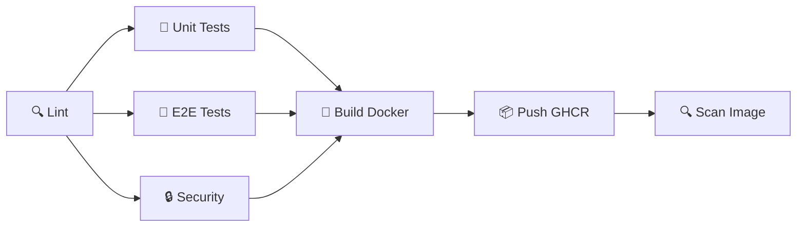

# 🚀 Guide DevOps Complet - Check-in App

> **Documentation complète de l'infrastructure CI/CD, des workflows GitHub Actions et de l'automatisation DevOps**

---

## 📋 Table des Matières

1. [Vue d'Ensemble](#vue-densemble)
2. [Architecture CI/CD](#architecture-cicd)
3. [Workflows GitHub Actions](#workflows-github-actions)
   - [Backend CI](#backend-ci)
   - [Frontend CI](#frontend-ci)
   - [Mobile CI](#mobile-ci)
   - [Deploy Production](#deploy-production)
   - [Security Scan](#security-scan)
4. [Dependabot](#dependabot---gestion-automatique-des-dépendances)
5. [Stratégie de Branches](#stratégie-de-branches)
6. [Environnements](#environnements)
7. [Secrets et Variables](#secrets-et-variables)
8. [Infrastructure](#infrastructure)
9. [Monitoring et Alertes](#monitoring-et-alertes)
10. [Guide de Dépannage](#guide-de-dépannage)

---

## Vue d'Ensemble

### 🎯 Objectif

Cette infrastructure DevOps fournit un pipeline CI/CD **de qualité production** avec :
- ✅ Tests automatisés à chaque commit
- ✅ Analyse de sécurité continue
- ✅ Déploiement automatisé multi-environnements
- ✅ Mise à jour automatique des dépendances
- ✅ Monitoring et alertes en temps réel

### 📊 Schéma Global

```
┌─────────────────────────────────────────────────────────────────────────────┐
│                           FLUX CI/CD COMPLET                                 │
├─────────────────────────────────────────────────────────────────────────────┤
│                                                                              │
│   [Développeur]                                                              │
│        │                                                                     │
│        ▼                                                                     │
│   ┌─────────┐    ┌──────────┐    ┌──────────┐    ┌──────────┐              │
│   │  Push   │───▶│  Lint    │───▶│  Tests   │───▶│  Build   │              │
│   │ Commit  │    │  Format  │    │  Unit    │    │  Docker  │              │
│   └─────────┘    └──────────┘    │  E2E     │    └────┬─────┘              │
│                                  └──────────┘         │                     │
│                                       │               │                     │
│                                       ▼               ▼                     │
│                              ┌──────────────┐  ┌───────────┐               │
│                              │   Security   │  │   Push    │               │
│                              │    Scan      │  │   GHCR    │               │
│                              └──────────────┘  └─────┬─────┘               │
│                                                      │                      │
│                                                      ▼                      │
│                              ┌───────────────────────────────────┐         │
│                              │        DÉPLOIEMENT                 │         │
│                              │  Staging ──▶ Smoke Tests ──▶ Prod  │         │
│                              └───────────────────────────────────┘         │
│                                                                              │
└─────────────────────────────────────────────────────────────────────────────┘
```

---

## Architecture CI/CD

### 🏗️ Composants Principaux

| Composant | Technologie | Rôle |
|-----------|-------------|------|
| **CI/CD** | GitHub Actions | Orchestration des pipelines |
| **Registry** | GitHub Container Registry (ghcr.io) | Stockage des images Docker |
| **Scan Sécurité** | Snyk, CodeQL, Trivy | Détection des vulnérabilités |
| **Couverture Code** | Codecov | Rapports de couverture |
| **Dépendances** | Dependabot | Mises à jour automatiques |
| **Monitoring** | Prometheus + Grafana | Métriques et tableaux de bord |

### ⚙️ Déclencheurs

| Événement | Workflows Déclenchés |
|-----------|---------------------|
| `push` sur `master/main/develop` | Backend CI, Frontend CI, Mobile CI |
| `push` sur `feature/**` | CI correspondant au chemin modifié |
| `pull_request` | CI correspondant au chemin modifié |
| `schedule` (cron) | Security Scan (hebdomadaire) |
| `workflow_dispatch` | Deploy Production, Security Scan (manuel) |

---

## Workflows GitHub Actions

### Backend CI

📁 **Fichier:** `.github/workflows/backend-ci.yml`

#### Description
Pipeline CI complet pour le backend NestJS avec tests, build Docker et scan de sécurité.

#### Étapes du Pipeline



#### Jobs Détaillés

| Job | Durée | Description |
|-----|-------|-------------|
| `lint` | ~10 min | ESLint, Prettier, TypeScript compilation |
| `unit-tests` | ~25 min | Tests unitaires avec couverture (Jest) |
| `e2e-tests` | ~25 min | Tests E2E avec MongoDB et Redis réels |
| `security` | ~15 min | npm audit, Snyk, CodeQL |
| `build` | ~20 min | Build et push image Docker |
| `scan-image` | ~15 min | Scan Trivy de l'image |

#### Services Utilisés

```yaml
services:
  mongodb:
    image: mongo:7.0
    ports: ["27017:27017"]
  
  redis:
    image: redis:7-alpine
    ports: ["6379:6379"]
```

#### Variables d'Environnement

| Variable | Description |
|----------|-------------|
| `NODE_VERSION` | Version Node.js (20.x) |
| `REGISTRY` | ghcr.io |
| `IMAGE_NAME` | {repo}/backend |

---

### Frontend CI

📁 **Fichier:** `.github/workflows/frontend-ci.yml`

#### Description
Pipeline CI pour l'application Next.js avec tests, build optimisé et containerisation.

#### Étapes du Pipeline

```
┌──────────────┐     ┌──────────────┐     ┌──────────────┐
│   🔍 Lint    │────▶│   🧪 Tests   │────▶│  🏗️ Build   │
│   ESLint     │     │   Jest/RTL   │     │   Next.js    │
│   TypeScript │     │   Couverture │     │   Optimisé   │
└──────────────┘     └──────────────┘     └──────────────┘
                                                  │
                                                  ▼
                                          ┌──────────────┐
                                          │  🐳 Docker   │
                                          │   Build &    │
                                          │   Push GHCR  │
                                          └──────────────┘
```

#### Caractéristiques

- **ESLint** avec max-warnings=200 (permet les warnings React Compiler)
- **TypeScript** vérification stricte
- **Build Next.js** avec optimisation production
- **Image Docker** multi-stage légère

---

### Mobile CI

📁 **Fichier:** `.github/workflows/mobile-ci.yml`

#### Description
Pipeline CI pour l'application Flutter avec analyse, tests et builds Android/iOS.

#### Étapes du Pipeline

```
┌──────────────┐     ┌──────────────┐     ┌──────────────┐
│  🔍 Analyze  │────▶│   🧪 Tests   │────▶│  🏗️ Build   │
│   dart fmt   │     │   Flutter    │     │   APK Debug  │
│   flutter    │     │   Test       │     │   Android    │
│   analyze    │     │   Couverture │     │              │
└──────────────┘     └──────────────┘     └──────────────┘
```

#### Configuration Flutter

```yaml
env:
  FLUTTER_VERSION: '3.24.0'
  JAVA_VERSION: '17'
```

#### Jobs

| Job | Description |
|-----|-------------|
| `analyze` | Format Dart, Flutter analyze (--fatal-warnings) |
| `test` | Tests unitaires et widget avec couverture |
| `build-android` | Build APK debug pour tests |

---

### Deploy Production

📁 **Fichier:** `.github/workflows/deploy-production.yml`

#### Description
Pipeline de déploiement manuel avec sécurités multiples pour staging et production.

#### 🛑 Sécurités Intégrées

1. **Event Day Freeze** - Gel des déploiements pendant les événements
2. **Validation Pre-déploiement** - Vérification des images
3. **Smoke Tests** - Tests de fumée avant déploiement
4. **Approbation Manuelle** - Environnements GitHub protégés

#### Paramètres du Workflow

| Paramètre | Type | Description |
|-----------|------|-------------|
| `environment` | choice | staging / production |
| `backend_version` | string | Tag image backend |
| `frontend_version` | string | Tag image frontend |
| `skip_tests` | boolean | Ignorer smoke tests (déconseillé) |
| `event_day_override` | string | Saisir "DEPLOY" pour forcer |

#### Flux de Déploiement

```
┌─────────────────────────────────────────────────────────────────┐
│                    FLUX DE DÉPLOIEMENT                          │
├─────────────────────────────────────────────────────────────────┤
│                                                                  │
│   ┌─────────────┐    ┌─────────────┐    ┌─────────────┐        │
│   │  🛑 Event   │───▶│  🔍 Valider │───▶│  🧪 Smoke   │        │
│   │  Day Check  │    │   Images    │    │   Tests     │        │
│   └─────────────┘    └─────────────┘    └──────┬──────┘        │
│                                                 │               │
│                           ┌─────────────────────┴───────┐      │
│                           │                             │      │
│                           ▼                             ▼      │
│                    ┌─────────────┐              ┌─────────────┐│
│                    │  🚀 Deploy  │              │  🚀 Deploy  ││
│                    │   Staging   │─────────────▶│  Production ││
│                    │   (auto)    │  approval    │  (manuel)   ││
│                    └─────────────┘              └─────────────┘│
│                                                                 │
└─────────────────────────────────────────────────────────────────┘
```

---

### Security Scan

📁 **Fichier:** `.github/workflows/security-scan.yml`

#### Description
Scan de sécurité hebdomadaire complet de tous les composants.

#### Planification

```yaml
schedule:
  - cron: '0 3 * * 1'  # Chaque lundi à 3h00 UTC
```

#### Types de Scan

| Type | Outils | Cibles |
|------|--------|--------|
| `dependencies` | npm audit, pip-audit | Dépendances |
| `containers` | Trivy | Images Docker |
| `code` | CodeQL, Semgrep | Code source |
| `full` | Tous | Complet |

#### Rapports

- Upload vers GitHub Security (SARIF)
- Création d'issues automatiques pour vulnérabilités critiques

---

## Dependabot - Gestion Automatique des Dépendances

📁 **Fichier:** `.github/dependabot.yml`

### 🤖 Vue d'Ensemble

Dependabot analyse automatiquement les dépendances et crée des Pull Requests pour les mises à jour.

### Configuration par Écosystème

#### Backend (npm)

```yaml
- package-ecosystem: "npm"
  directory: "/backend"
  schedule:
    interval: "weekly"
    day: "monday"
    time: "06:00"
```

**Groupes de Dépendances:**
| Groupe | Packages |
|--------|----------|
| `nestjs` | @nestjs/* |
| `mongodb` | mongoose, @nestjs/mongoose |
| `redis` | ioredis, bull, cache-manager |
| `testing` | jest, supertest |
| `typescript` | typescript, @types/* |

#### Frontend (npm)

```yaml
- package-ecosystem: "npm"
  directory: "/frontend"
```

**Groupes:**
| Groupe | Packages |
|--------|----------|
| `nextjs` | next, react, react-dom |
| `ui` | @radix-ui/*, tailwindcss |
| `testing` | jest, @testing-library/* |

#### Mobile (pub/Dart)

```yaml
- package-ecosystem: "pub"
  directory: "/checkin_mobile"
```

#### GitHub Actions

```yaml
- package-ecosystem: "github-actions"
  directory: "/"
```

#### Docker

```yaml
- package-ecosystem: "docker"
  directory: "/infrastructure/docker"
```

#### Terraform

```yaml
- package-ecosystem: "terraform"
  directory: "/infrastructure/terraform"
```

### Labels et Reviewers

Chaque PR Dependabot reçoit automatiquement :
- **Labels:** `dependencies`, `{composant}`, `automated`
- **Reviewer:** `medma`
- **Prefix commit:** `chore(deps)`

### Règles d'Ignorance

```yaml
ignore:
  # Pas de majeurs pour NestJS (breaking changes)
  - dependency-name: "@nestjs/*"
    update-types: ["version-update:semver-major"]
  
  # Pas de majeurs pour Mongoose
  - dependency-name: "mongoose"
    update-types: ["version-update:semver-major"]
```

---

## Stratégie de Branches

### 🌳 Modèle Git Flow

```
                    ┌───────────────────────────────────────────┐
                    │              master (production)          │
                    └─────────────────────┬─────────────────────┘
                                          │
                          ┌───────────────┼───────────────┐
                          │               │               │
                          ▼               ▼               ▼
                    ┌─────────┐     ┌─────────┐     ┌─────────┐
                    │ hotfix/ │     │release/ │     │         │
                    │  *      │     │  1.x    │     │         │
                    └─────────┘     └────┬────┘     │         │
                                         │          │         │
                    ┌────────────────────┴──────────┤         │
                    │           develop              │         │
                    └────────────────────────────────┘         │
                                    │                          │
                    ┌───────────────┼───────────────┐         │
                    │               │               │         │
                    ▼               ▼               ▼         │
              ┌─────────┐     ┌─────────┐     ┌─────────┐     │
              │feature/ │     │feature/ │     │feature/ │     │
              │  auth   │     │  api    │     │  ui     │     │
              └─────────┘     └─────────┘     └─────────┘     │
```

### Conventions de Nommage

| Type | Format | Exemple |
|------|--------|---------|
| Feature | `feature/{description}` | `feature/qr-scanner` |
| Bugfix | `bugfix/{description}` | `bugfix/login-error` |
| Hotfix | `hotfix/{description}` | `hotfix/critical-fix` |
| Release | `release/{version}` | `release/1.3.0` |

### Protection des Branches

| Branche | Règles |
|---------|--------|
| `master` | PR obligatoire, CI doit passer, review requis |
| `develop` | PR obligatoire, CI doit passer |
| `release/*` | PR obligatoire vers master |

---

## Environnements

### 🌍 Configuration des Environnements GitHub

| Environnement | URL | Protection |
|---------------|-----|------------|
| `staging` | staging.checkin-app.example.com | CI doit passer |
| `production` | checkin-app.example.com | Approbation requise |

### Variables par Environnement

```yaml
# Staging
MONGODB_URI: mongodb://mongo:27017/checkin_staging
REDIS_URL: redis://redis:6379

# Production
MONGODB_URI: mongodb+srv://...
REDIS_URL: rediss://...
```

---

## Secrets et Variables

### 🔐 Secrets Requis

| Secret | Description | Utilisé par |
|--------|-------------|-------------|
| `GITHUB_TOKEN` | Token GitHub (auto) | Tous les workflows |
| `CODECOV_TOKEN` | Token Codecov | Backend CI, Frontend CI |
| `SNYK_TOKEN` | Token Snyk | Security Scan |
| `SLACK_WEBHOOK_URL` | Webhook Slack | Notifications |
| `KUBECONFIG` | Config Kubernetes | Deploy Production |
| `SSH_PRIVATE_KEY` | Clé SSH serveur | Deploy Production |

### Configuration des Secrets

1. Aller dans **Settings** > **Secrets and variables** > **Actions**
2. Cliquer sur **New repository secret**
3. Ajouter chaque secret requis

---

## Infrastructure

### 🐳 Docker

#### Images Produites

| Image | Tag | Taille |
|-------|-----|--------|
| `ghcr.io/{repo}/backend` | branch-sha, latest | ~200MB |
| `ghcr.io/{repo}/frontend` | branch-sha, latest | ~150MB |

#### Build Multi-Stage

```dockerfile
# Exemple Backend
FROM node:20-alpine AS builder
WORKDIR /app
COPY package*.json ./
RUN npm ci
COPY . .
RUN npm run build

FROM node:20-alpine AS production
WORKDIR /app
COPY --from=builder /app/dist ./dist
COPY --from=builder /app/node_modules ./node_modules
EXPOSE 3001
CMD ["node", "dist/main"]
```

### ☸️ Kubernetes

Manifestes dans `/infrastructure/kubernetes/`:

```
kubernetes/
├── base/
│   ├── namespace.yaml
│   ├── backend-deployment.yaml
│   ├── frontend-deployment.yaml
│   ├── services.yaml
│   └── ingress.yaml
├── staging/
│   └── kustomization.yaml
└── production/
    └── kustomization.yaml
```

### 🏗️ Terraform

Configuration dans `/infrastructure/terraform/`:

| Ressource | Description |
|-----------|-------------|
| VPC | Réseau isolé |
| EKS/AKS | Cluster Kubernetes |
| RDS/CosmosDB | Base de données |
| ElastiCache | Cache Redis |
| S3/Blob | Stockage |

---

## Monitoring et Alertes

### 📊 Stack Prometheus/Grafana

Configuration dans `/infrastructure/terraform/prometheus-values.yaml`

#### Métriques Collectées

| Métrique | Description |
|----------|-------------|
| `http_request_duration_seconds` | Latence API |
| `http_request_total` | Nombre de requêtes |
| `nodejs_heap_size_bytes` | Mémoire Node.js |
| `process_cpu_seconds_total` | CPU utilisé |

#### Alertes Configurées

```yaml
- alert: BackendHighLatency
  expr: histogram_quantile(0.95, ...) > 1
  for: 5m
  severity: warning

- alert: HighErrorRate
  expr: rate(http_errors[5m]) > 0.1
  for: 5m
  severity: critical
```

### 📱 Notifications

| Canal | Événements |
|-------|------------|
| Slack #ci-alerts | Échecs CI/CD |
| Email | Alertes critiques |
| PagerDuty | Incidents production |

---

## Guide de Dépannage

### ❌ Problèmes Courants

#### Le workflow ne se déclenche pas

**Causes possibles:**
1. Branche non configurée dans les triggers
2. Chemin modifié non surveillé
3. Fichier workflow avec erreur de syntaxe

**Solution:**
```bash
# Vérifier la syntaxe
yamllint .github/workflows/*.yml

# Forcer un trigger
git commit --allow-empty -m "chore: trigger CI"
git push
```

#### Échec de lint/format

**Solution:**
```bash
# Backend
cd backend
npm run lint -- --fix
npm run format

# Frontend
cd frontend
npm run lint -- --fix

# Mobile
cd checkin_mobile
dart format .
```

#### Tests E2E échouent

**Causes possibles:**
1. Services (MongoDB/Redis) non démarrés
2. Variables d'environnement manquantes
3. Timeout insuffisant

**Solution:**
```bash
# Vérifier les services
docker ps

# Relancer avec logs
npm run test:e2e -- --verbose
```

#### Image Docker non trouvée

**Vérifier:**
```bash
# Lister les images
docker manifest inspect ghcr.io/{repo}/backend:latest

# Vérifier l'authentification
echo $CR_PAT | docker login ghcr.io -u USERNAME --password-stdin
```

### 📞 Contacts

| Rôle | Contact |
|------|---------|
| DevOps Lead | @medma |
| Backend Lead | @medma |
| Urgences Prod | #prod-incidents |

---

## 📚 Ressources

- [GitHub Actions Documentation](https://docs.github.com/en/actions)
- [Dependabot Configuration](https://docs.github.com/en/code-security/dependabot)
- [Docker Best Practices](https://docs.docker.com/develop/develop-images/dockerfile_best-practices/)
- [Kubernetes Documentation](https://kubernetes.io/docs/)

---

*Documentation générée le 19 janvier 2026*
*Version: 1.3.0*
